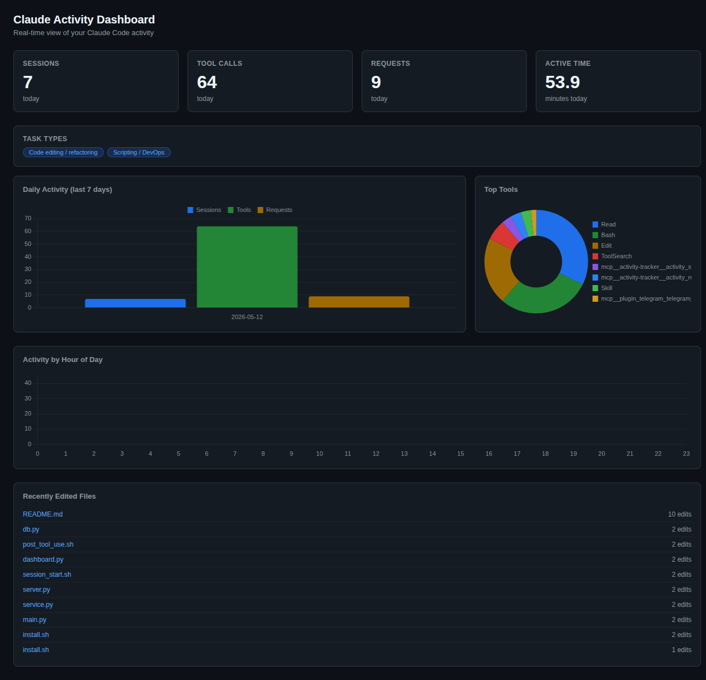
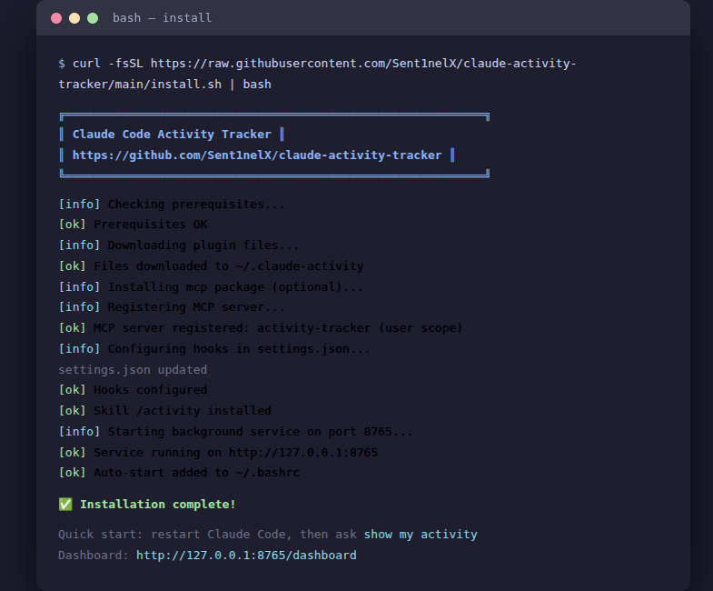
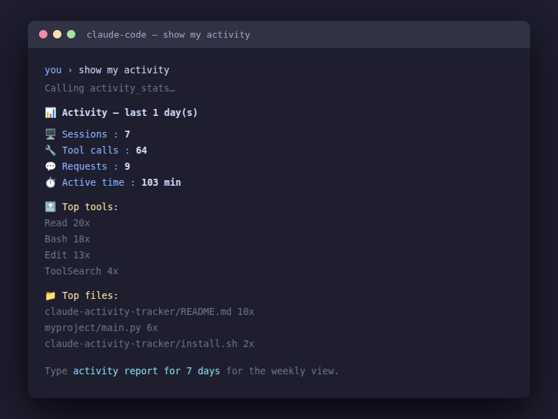

# Claude Code Activity Tracker


A lightweight, privacy-respecting plugin for [Claude Code](https://claude.ai/code) that automatically tracks your AI-assisted development activity — sessions, tool calls, files edited, and time spent. All data stays on your machine in a local SQLite database.



---

## Quick Install

```bash
curl -fsSL https://raw.githubusercontent.com/Sent1nelX/claude-activity-tracker/main/install.sh | bash
```



That's it. The installer will:
- Download all plugin files to `~/.claude-activity/`
- Register the MCP server with Claude Code
- Configure hooks (SessionStart, PreToolUse, Stop)
- Start the background service automatically
- Add auto-start to your shell profile

Then **restart Claude Code** and send a message like `show my activity` or `coding stats`.

> **Requirements:** Python 3.8+, `curl`

---

## Features

- **Automatic session tracking** — hooks into Claude Code start/stop events, no manual logging
- **Tool usage analytics** — see which MCP tools and Claude Code built-ins you reach for most
- **File edit heatmap** — discover which files you iterate on most across sessions
- **Web dashboard** — dark-themed HTML dashboard with Chart.js charts at `http://127.0.0.1:8765/dashboard`
- **GitHub correlation** — compare AI sessions against actual git commits (efficiency ratio)
- **VSCode correlation** — see which projects are active in both Claude Code and VSCode simultaneously
- **Plane integration** — fetch open issues from your Plane workspace alongside session data
- **Peak hour analysis** — discover when you're most productive with hourly heatmap
- **Daily & weekly reports** — instant summaries via the `/activity` skill command
- **MCP-native** — exposes metrics through a local MCP server so Claude can reason about your data
- **Zero cloud dependency** — SQLite on disk, nothing transmitted anywhere
- **Privacy-first** — records file paths and tool names only; never captures prompts or code content

---

## Manual Installation

If you prefer to inspect before running:

```bash
git clone https://github.com/Sent1nelX/claude-activity-tracker.git
cd claude-activity-tracker
./install.sh
```

> **Requirements:** Python 3.8+, Claude Code CLI (`claude`)

---

## Usage

### Asking Claude for your stats

Send a message to Claude in any Claude Code session. These all work:

```
show my activity
what did I work on today
coding stats
/activity
```

> **Note:** `/activity` is not a built-in slash command — it won't appear in the autocomplete menu (like `/usage` or `/status`). It's a skill trigger word: type it as a regular message and Claude will invoke the skill.

Claude will call the `activity_stats` MCP tool and display a formatted text report:

```
📊 Activity — last 1 day(s)

🖥️  Sessions      : 3
🔧 Tool calls    : 47
💬 Requests      : 12
⏱️  Active time   : 94 min

🔝 Top tools:
   Edit                           18x
   Read                           14x
   Bash                            9x

📁 Top files:
   /home/user/project/src/server.py    7x
   /home/user/project/hooks/pre_tool.py 4x
```



For a weekly report, ask: `activity report for 7 days` or call `activity_report` directly.

### Web Dashboard

Open your browser at `http://127.0.0.1:8765/dashboard` while the service is running. You'll see a dark-themed dashboard with:

- **Stat cards** — sessions, tool calls, requests, active time (today)
- **Daily activity chart** — 7-day bar chart (sessions / tools / requests)
- **Top tools doughnut** — which tools you use most
- **Hourly heatmap** — line chart showing your peak hours across 24h
- **Task type tags** — inferred categories (editing, reading, testing, …)
- **Recent files table** — most-edited files with edit counts

No extra setup needed — the `/dashboard` endpoint is served by the same daemon that receives hook events.

### MCP Tools

The plugin registers an `activity-tracker` MCP server with tools you can call directly or reference in prompts:

| Tool | Description |
|------|-------------|
| `activity_stats` | Today's session summary — duration, tool calls, files edited |
| `activity_session` | Details for a specific session |
| `activity_files` | Most-edited files ranked by edit count |
| `activity_patterns` | Peak hours, day-of-week heatmap, task type breakdown |
| `activity_github` | Correlate AI sessions with git commits (efficiency ratio) |
| `activity_report` | Multi-day report with daily breakdown (default: 7 days). Accepts `{ "days": N }` |
| `activity_export` | Export data as JSON or POST to a webhook |
| `activity_vscode` | Correlate Claude Code sessions with VSCode activity — shared projects and overlap |
| `activity_plane` | Fetch open issues from a Plane workspace, or show setup instructions |

---

## Architecture

```
Claude Code session
       │
       ├── SessionStart hook ─── hooks/session_start.sh ─┐
       │                                                   │  HTTP POST /event
       ├── PreToolUse hook ───── hooks/pre_tool_use.sh ───► 127.0.0.1:8765
       │                                                   │  (service.py daemon)
       └── Stop hook ─────────── hooks/session_end.sh  ───┘
                                                           │
                                                    SQLite (~/.claude-activity/activity.db)
                                                        │          │
                                           service.py --mcp    GET /dashboard
                                           (stdio server)       (browser)
                                                  │
                                            Claude Code
                                    (activity_stats, activity_github, …)
```

A single unified daemon (`service.py`) runs two servers in one process:
- **HTTP :8765** — receives events from lightweight bash hooks via `curl`
- **MCP stdio** — answers tool queries from Claude Code (started via `claude mcp add`)

---

## Data Collected

The tracker records only the minimum needed for productivity metrics:

| What is recorded | Example |
|-----------------|---------|
| Session start/end timestamps | `2026-05-12 09:14:32` |
| Tool name invoked | `Edit`, `Bash`, `Read` |
| File path of edited files | `/home/user/project/src/app.py` |
| Session duration | `47 minutes` |

**What is never recorded:**
- Prompt or message text
- Code content or file contents
- API keys or environment variables
- Terminal output

All data lives in `~/.claude-activity/activity.db` and never leaves your machine.

---

## Service Management

```bash
# Check status
python3 ~/.claude-activity/src/service.py --status

# Stop daemon
python3 ~/.claude-activity/src/service.py --stop

# Restart
python3 ~/.claude-activity/src/service.py --daemon
```

---

## Plane Setup

To connect your Plane workspace:

1. Get your API key from **Plane → Settings → API Tokens**
2. Save your config:

```python
import json
from pathlib import Path

cfg = {
    "plane_workspace_url": "https://app.plane.so/YOUR_WORKSPACE",
    "plane_api_key": "YOUR_KEY"
}
(Path.home() / ".claude-activity" / "config.json").write_text(json.dumps(cfg))
```

3. Call `activity_plane` — it will fetch your open issues automatically.

---

## Roadmap

- [x] **VSCode correlation** — detect shared projects across Claude Code and VSCode sessions
- [x] **Plane integration** — link sessions to Plane issues and sprints
- [x] **Web dashboard** — dark-themed HTML dashboard with Chart.js at `http://127.0.0.1:8765/dashboard`
- [ ] **Team aggregation** — opt-in anonymized team stats
- [ ] **Goal tracking** — daily coding time targets with progress bars

---

## Contributing

Contributions are welcome. For significant changes, please open an issue first to discuss what you'd like to change.

```bash
# Development setup
git clone https://github.com/Sent1nelX/claude-activity-tracker.git
cd claude-activity-tracker
pip3 install -r requirements.txt

# Run tests
python3 -m pytest tests/

# Run the server locally
python3 src/server.py
```

Please make sure your changes include tests where applicable and keep individual files under 500 lines.

---

## License

[MIT](LICENSE) — free to use, modify, and distribute.
